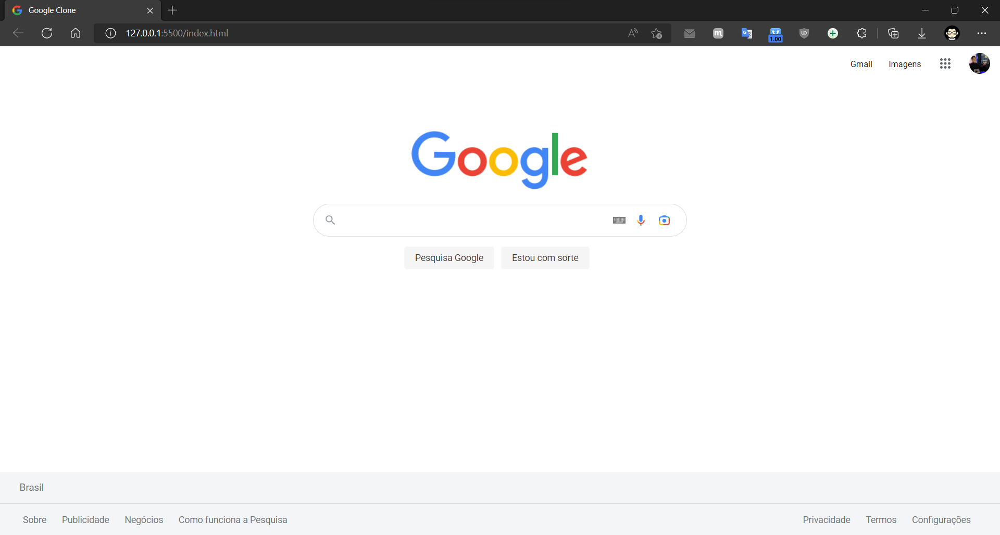
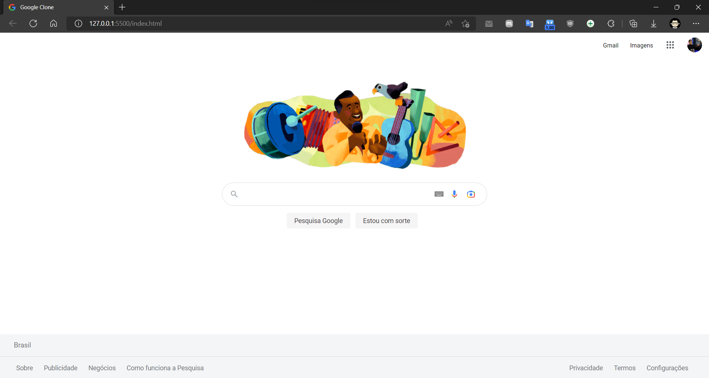
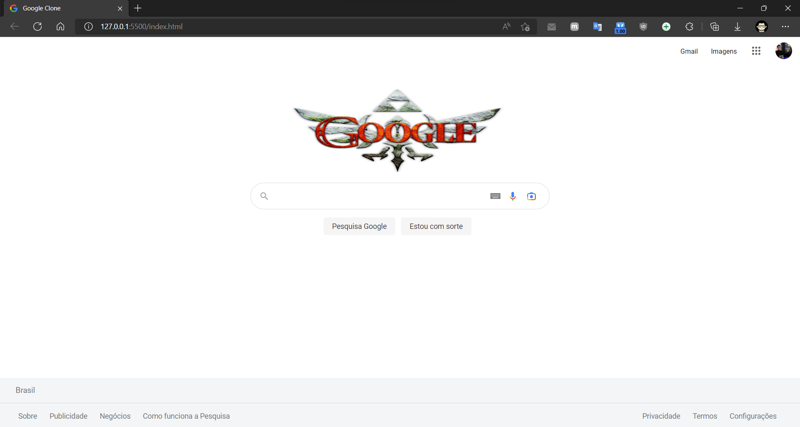

<h1 align="center"> Google Clone </h1>

### Link da página: [Clique aqui](https://google-clone-tawny-eta.vercel.app/).

  <a href="#-tecnologias">Tecnologias</a>&nbsp;&nbsp;&nbsp;|&nbsp;&nbsp;&nbsp;
  <a href="#-projeto">Projeto</a>&nbsp;&nbsp;&nbsp;|&nbsp;&nbsp;&nbsp;
  <a href="#-layout">Layout</a>&nbsp;&nbsp;&nbsp;|&nbsp;&nbsp;&nbsp;

 

  <h3 align="center"> Logo 01 - Default</h3>
  

  <h3 align="center"> Logo 02 - Doodle</h3>
  

  <h3 align="center"> Logo 03 - EasterEgg</h3>
  
  
  <h3 align="center"> Video de Demonstração</h3>
  

https://user-images.githubusercontent.com/53373326/197402841-95ab06b8-1f86-4500-a3ae-34770364cd6c.mp4

## 🚀 Tecnologias

Esse projeto foi desenvolvido com as seguintes tecnologias:

- HTML5 
- CSS3

## 💻 Projeto

O Google Clone é uma simulação da página inicial do Google. O intuito do projeto foi testar minhas habilidades com CSS e HTML.

## 🔖 Layout

Você pode visualizar o layout original do projeto através [DESSE LINK](https://www.google.com.br).

---

Feito com ❤️ por Bruno Benicio
